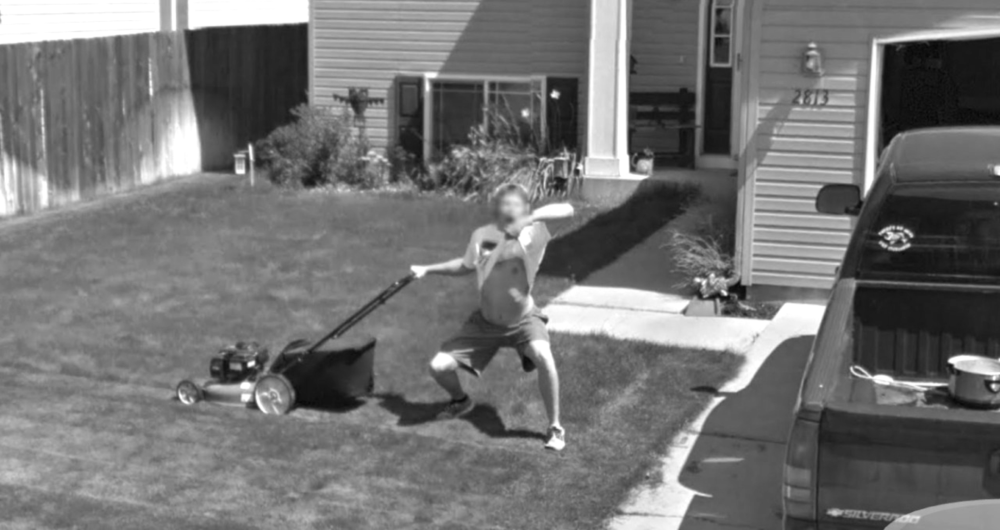

# Classifying Google Street View House Numbers

### Project Description

An exploration of supervised classification models and image thresholding techniques to classify house numbers within [Google street view](https://www.google.com/streetview/) images.

---

## Motivation 

Currently today, neural networks are typically used with object detection and image classification for the best results. However, since these networks are typically quite complex and difficult to understand, I wanted to first explore more traditional supervised machine learning methods and image processing techniques to gain a better understanding when working with images and large feature sets.

---

## Data Source

- [Standford](http://ufldl.stanford.edu/housenumbers/ "Google SVHN Dataset") - Google Street View House Numbers (SVHN) Dataset 
  
  Ref: Yuval Netzer, Tao Wang, Adam Coates, Alessandro Bissacco, Bo Wu, Andrew Y. Ng 
  <strong>Reading Digits in Natural Images with Unsupervised Feature Learning</strong> 
  <em>NIPS Workshop on Deep Learning and Unsupervised Feature Learning 2011</em>

---

## Libraries Utilized
  * Scipy - Load images from .mat format (MATLAB)
  * OpenCV - Image manipulation (grayscale, thresholds)
  * Sckit-Learn - Estimator models
  
---

## Process
  1. (*TBD) Downsample classes to balance (equal number of images from each digit class)
  2. Crop images to reduce secondary digits (noise) on either side of main digit being classified
  3. Convert to grayscale to reduce feature space (RGB colors)
  4. Apply threshold to further reduce feature space (bin/bucket based on grascale shades)
  5. Convert multi-dimensional image array to one-dimensional array (image array flatted to 1D, end result is 2D array - stack of 1D image arrays)
  6. Train models using 2D image array
  7. Test models and evaluate performace
  8. Tune/optimize model parameters
  
---

## Results
- Original [presentation](static/StreetView.pdf) delivered on 08/05/2016
